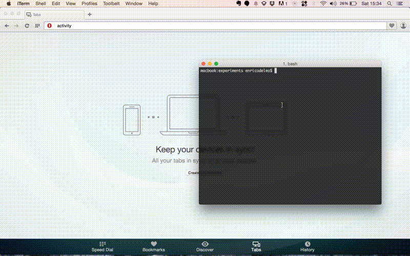

# WPacked

**WPacked** tries to give you an easy development starter kit easy to maintain and deploy, **within a clean pure local environment**. Just like you usually do with npm.

No more XAMP/MAMP or virtual machines, or other (often conflicting) softwares on your local machines. 
**You just need PHP**. 

Clean, versionable, quick.

## Background

I really like developing using the Node.js-ecosystem. I love to make my projects modular with npm and bower, I adore the easy dependency management. 
The thing I like the most is that I can start working immediately on my local machine without a full fledged webserver.

Of course there are tools that give you quickly(sh) a development server within your machine, (I'm personally a big fan of [roots/bedrock](https://github.com/roots/bedrock), that inspired this project) but all of them need a Vagrant virtual machine. Quite an overkill for most project.

I also like the idea of just dropping a project on a webserver when I'm done (almost impossible with MySQL). 

I tried to create a lovely and easy development flow with my favorite CMS, so here we are: my attempt to make WordPress as a self contained, _packaged application_ as possible. Hope you enjoy it ;)



## Slideshare presentation

Checkout the presentation published during August Wordpress Meetup in Rome http://www.slideshare.net/EnricoDeleo/modern-gentlemens-wordpress

## Key features

* Git-friendly
* Dependency management via [Composer](https://getcomposer.org/)
* Deployable and versionable DB thanks to [SQLite Integration](https://wordpress.org/plugins/sqlite-integration/) (WordPress Plugin)

## Requirements

* A Unix-like OS
* PHP >= 5.4
* Composer
* SQLite

## Requirements installation

### OS X 

#### Quickest, built-in solution

You're OS is shipped with php and SQLite already installed. [Follow these instructions to get Composer](https://getcomposer.org/doc/00-intro.md).

#### My favorite 

As a developer you might want to use the version of php of your choice (remember you need at least 5.4).
The best way to manage packages and installations on your Mac is _Homebrew_. 
If you haven't it yet, well you should. Follow the instructions [on the Homebrew's official website](http://brew.sh/).

Suggested to update homebrew to the latest version

```bash
$ brew update && brew upgrade
```

Then install the php version of your choice with

```bash
$ brew install php56
```

You'll need also Composer, so let install it:

```bash
brew install composer
```

#### Optional

Optional but suggested [wp-cli](https://github.com/wp-cli/wp-cli). It'll speed up several operations giving you the possibility to issue commands to WordPress via terminal.
This repo has a wp-cli.yml that automatically will point wp-cli to the actual wordpress directory, you just need to use the `wp` command inside the project directory.

```bash
brew install wp-cli
```

### Linux

- todo, feel free to make a pull request -

## Usage

Now the reason of the all thing: instant development. Just two commands.   

Clone this repo and type 

```bash
composer install
```

in order to install all the dependencies of the project. **You are already done**, just launch the php's built-in server with

```bash
php -S localhost:8000 -t app/
```

## WP Configuration

Thanks to phpdotenv you can store your configurations outside the public directory in a `.env` file. You'll find the file `.env.example` that you need to copy to `.env` within the root directory of the project with the following variables:

|**variable name** |**role**|
|------------------|--------|
| ENVIRNOMENT      | the environment where the app lives in (development, staging, production) |
| WP_HOME          | the url of the website|
| WP_SITEURL       | the url of the wordpress directory, here is urlofthesite.ltd/wordpress|
| DB_NAME          | name of the MySQL DB|
| DB_USER          | user of the MySQL DB|
| DB_PASSWORD      | password of the MySQL DB|
| DB_HOST          | host of the MySQL DB|
| USE_MYSQL        | `1` for MySQL, `0` for SQLite|
| DISABLE_WP_CRON  | whether or not the app should use the WP cron system (false requires setting up cron manually on your server)|

**For security purposes, don't forget to set AUTH_KEY, SECURE_AUTH_KEY, LOGGED_IN_KEY, NONCE_KEY, AUTH_SALT, SECURE_AUTH_SALT, LOGGED_IN_SALT, NONCE_SALT to different (long) random strings on production.**

**NOTE**
Don't commit the `.env` file, it's very likely that you want sapearate settings for each copy of the project. e.g. different urls for each environment like website.dev, staging.website.com and website.com. Just set those domains on each respective .env and you're ready to go :)

## Deploy :zap:

Thanks to SQLite DB the project itself is a self-contained package. You can just upload it to your server and point the webserver of your choice to `/path/to/project/app`.


## How to add WordPress Plugins

All the php dependencies are managed by Composer, the same happens for WordPress plugins (of course if they are commodities and not custom ones). You can find all the packagist entries for WordPress plugins on the [WPackagist official website](http://wpackagist.org/). 

For example, searching for buddypress would return something like `"wpackagist-plugin/buddypress": "~2.3.0"`, you just need to drop this line inside the `composer.json` file and type 

```bash
composer update
```

The whole plugins directory is under `.gitignore`, so if you add custom plugins you need to exclude them (you'll find an example within the .gitignore file) and add them to git.

_________________________________________


## Notes about SQLite

Even if the WordPress plugin included on this repo tries to create a drop-in replacement for MySQL converting all the MySQL queries to SQLite, there are certain operations that are not possible on SQLite. Hence, some plugin may not work as expected. You can see [a list of known non-working plugins here](http://dogwood.skr.jp/wordpress/sqlite-integration/#plugin-compat). I personally haven't found issues with other plugins until now (even heavy ones like WPML) but keep in mind that it could happen.

Another characteristic to keep in mind is that **SQLite is far from being a production database for big sites or with an heavy traffic**. In those cases you want to stay on a more efficient and scalable db engine like MySQL (or my favorite, MariaDB). You can switch from SQLite to MySQL without uninstalling the plugin with a simple false in the config file (keeping SQLite on local machine and MySQL on staging and production is a way).

_________________________________________

## Author
[Enrico Deleo](https://enricodeleo.com)

